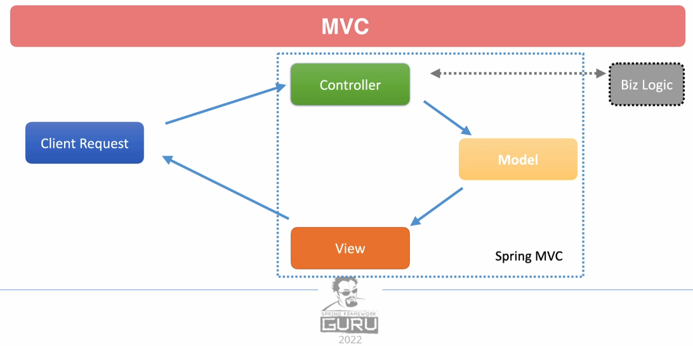

# Spring Framework 6: Beginner to Guru

This repository is for an example application built in my [Spring Framework 6 - Beginner to Guru](https://www.udemy.com/course/spring-framework-6-beginner-to-guru/?referralCode=2BD0B7B7B6B511D699A9) online course

The application is a simple Spring Boot 3 / Spring Framework 6 web application. It is used to help students learn how
to use the Spring Framework. Step by step instructions and detailed explanations can be found within the course.

As you work through the course, please feel free to fork this repository to your out GitHub repo. Most links contain links
to source code changes. If you encounter a problem you can compare your code to the lesson code. [See this link for help with compares](https://github.com/springframeworkguru/spring5webapp/wiki#getting-an-error-but-cannot-find-what-is-different-from-lesson-source-code)

## Spring Framework 6: Beginner to Guru Course Wiki
Got a question about your Spring Framework 6 course? [Checkout these FAQs!](https://github.com/springframeworkguru/spring5webapp/wiki)

## Getting Your Development Environment Setup
### Recommended Versions
| Recommended             | Reference                                                                                                                                                     | Notes                                                                                                                                                                                                                  |
|-------------------------|---------------------------------------------------------------------------------------------------------------------------------------------------------------|------------------------------------------------------------------------------------------------------------------------------------------------------------------------------------------------------------------------|
| Oracle Java 21 JDK      | [Download](https://www.oracle.com/java/technologies/downloads/#java21) | Java 17 or higher is required for Spring Framework 6. Java 21 is recommended for the course.                                                                                                                           |
| IntelliJ 2024 or Higher | [Download](https://www.jetbrains.com/idea/download/)                                                                                                          | Ultimate Edition recommended. Students can get a free 120 trial license [here](https://github.com/springframeworkguru/spring5webapp/wiki/Which-IDE-to-Use%3F#how-do-i-get-the-free-120-day-trial-to-intellij-ultimate) |
| Maven 3.9.6 or higher   | [Download](https://maven.apache.org/download.cgi)                                                                                                             | [Installation Instructions](https://maven.apache.org/install.html)                                                                                                                                                     |
| Gradle 8.7 or higher    | [Download](https://gradle.org/install/)                                                                                                                       |                                                                                                                                                                     |
| Git 2.39 or higher      | [Download](https://git-scm.com/downloads)                                                                                                                     |                                                                                                                                                                                                                        | 
| Git GUI Clients         | [Downloads](https://git-scm.com/downloads/guis)                                                                                                               | Not required. But can be helpful if new to Git. SourceTree is a good option for Mac and Windows users.                                                                                                                 |

## All Spring Framework Guru Courses
### Spring Framework 6
* [Spring Framework 6 - Beginner to Guru](https://www.udemy.com/course/spring-framework-6-beginner-to-guru/?referralCode=2BD0B7B7B6B511D699A9)
* [Spring AI: Beginner to Guru](https://www.udemy.com/course/spring-ai-beginner-to-guru/?referralCode=EF8DB31C723FFC8E2751)
* [Hibernate and Spring Data JPA: Beginner to Guru](https://www.udemy.com/course/hibernate-and-spring-data-jpa-beginner-to-guru/?referralCode=251C4C865302C7B1BB8F)
* [API First Engineering with Spring Boot](https://www.udemy.com/course/api-first-engineering-with-spring-boot/?referralCode=C6DAEE7338215A2CF276)
* [Introduction to Kafka with Spring Boot](https://www.udemy.com/course/introduction-to-kafka-with-spring-boot/?referralCode=15118530CA63AD1AF16D)
* [Spring Security: Beginner to Guru](https://www.udemy.com/course/spring-security-core-beginner-to-guru/?referralCode=306F288EB78688C0F3BC)

### Spring Framework 5
* [Spring Framework 5: Beginner to Guru](https://www.udemy.com/testing-spring-boot-beginner-to-guru/?couponCode=GITHUB_REPO) - Get the most modern and comprehensive course available for the Spring Framework! Join over 17,200 over Guru's in an Slack community exclusive to this course! More than 5,700 students have given this 53 hour course a 5 star review!
* [Spring Boot Microservices with Spring Cloud Beginner to Guru](https://www.udemy.com/course/spring-boot-microservices-with-spring-cloud-beginner-to-guru/?referralCode=6142D427AE53031FEF38) - Master Microservice Architectures Using Spring Boot 2 and Cloud Based Deployments with Spring Cloud and Docker
* [Reactive Programming with Spring Framework 5](https://www.udemy.com/reactive-programming-with-spring-framework-5/?couponCode=GITHUB_REPO_SF5B2G) - Keep your skills razor sharp and take a deep dive into Reactive Programming!
* [Testing Spring Boot: Beginner to Guru](https://www.udemy.com/testing-spring-boot-beginner-to-guru/?couponCode=GITHUB_REPO_SF5B2G) - ** Best Selling Course** Become an expert in testing Java and Spring Applications with JUnit 5, Mockito and much more!

### SQL
* [SQL Beginner to Guru: MySQL Edition](https://www.udemy.com/sql-beginner-to-guru-mysql-edition/?couponCode=GITHUB_REPO_SF5B2G) - SQL is a fundamental must have skill, which employers are looking for. Learn to master SQL on MySQL, the worlds most popular database!

### DevOps
* [Apache Maven: Beginner to Guru](https://www.udemy.com/apache-maven-beginner-to-guru/?couponCode=GITHUB_REPO_SF5B2G) - **Best Selling Course** Take the mystery out of Apache Maven. Learn how to use Maven to build your Java and Spring Boot projects!
* [OpenAPI: Beginner to Guru](https://www.udemy.com/course/openapi-beginner-to-guru/?referralCode=0E7F511C749013CA6AAD) - Master OpenAPI (formerly Swagger) to Create Specifications for Your APIs
* [OpenAPI: Specification With Redocly](https://www.udemy.com/course/openapi-specification-redocly-api-documentation/?referralCode=863C443928D61D9A3831)
* [Docker for Java Developers](https://www.udemy.com/docker-for-java-developers/?couponCode=GITHUB_REPO_SF5B2G) - Best Selling Course on Udemy! Learn how you can supercharge your development by leveraging Docker. Collaborate with other students in a Slack community exclusive to the course!
* [Spring Framework DevOps on AWS](https://www.udemy.com/spring-core-devops-on-aws/?couponCode=GITHUB_REPO_SF5B2G) - Learn how to build and deploy Spring applications on Amazon AWS!
* [Ready for Production with Spring Boot Actuator](https://www.udemy.com/ready-for-production-with-spring-boot-actuator/?couponCode=GITHUB_REPO_SF5B2G) - Learn how to leverage Spring Boot Actuator to monitor your applications running in production.

### Web Development with Spring Framework
* [Mastering Thymeleaf with Spring Boot](https://www.udemy.com/mastering-thymeleaf-with-spring/?couponCode=GITHUB_REPO_SF5B2G) - Once you learn Thymeleaf, you'll never want to go back to using JSPs for web development!


## Connect with Spring Framework Guru
* Spring Framework Guru [Blog](https://springframework.guru/)
* Subscribe to Spring Framework Guru on [YouTube](https://www.youtube.com/channel/UCrXb8NaMPQCQkT8yMP_hSkw)
* Like Spring Framework Guru on [Facebook](https://www.facebook.com/springframeworkguru/)
* Follow Spring Framework Guru on [Twitter](https://twitter.com/spring_guru)
* Connect with John Thompson on [LinkedIn](http://www.linkedin.com/in/springguru)

# My Notes

## Spring Framework and Spring Boot

In 2003 EJB was referred to as "XML Java Hell" this is what Spring Framework replaced

Spring Framework: collection of framework libraries

Spring Boot: automated tooling for Spring applications, think about it like a wrapper around Spring

Spring boot:
* has starter dependencies
* auto-configs for classes found on classpath (ex.: autoconfigs in memory database if H2 is on class path)

By default Spring Boot:
* has integrated tomcat server
* responds with HTML via HTTP to requests made to tomcat server

There are multiple Spring projects:
* Spring Data	- Collection of projects for persisting data to SQL and noSQL DBs
* Spring Cloud	- Tools for distributed systems, good for microservices and cloud services
* Spring Security
* Spring Session	- Distributed web app sessions
* Spring Integration	- Enterprise Integration Patterns
* Spring Batch	- batch processing
* Spring State Machine	- open source state machine


## App Overview


A simple Spring Boot architecture that we will use as our first app.


We will have 4 packages.

Maven specifies the Standard Directory Layout that maven projects should follow, 
this is what spring initializer follows too: https://maven.apache.org/guides/introduction/introduction-to-the-standard-directory-layout.html

## H2 Database

Spring Boot comes with a H2 in-memory database.

To enable console you should configure the project. Example for .properties:
```properties
spring.h2.console.enabled=true
```

Then after starting up the spring boot service the logs will show something like this:
```
2024-10-13T...  INFO 3688 --- [main] o.s.b.a.h2.H2ConsoleAutoConfiguration    : H2 console available at '/h2-console'. Database available at 'jdbc:h2:mem:{DB ID}'
```

By default, on http://localhost:8080/h2-console you will find the console. The 'jdbc:h2:mem:{DB ID}' string will define the JDBC URL that you can connect to in the console.

## Hibernate

Hibernate creates the database tables by reflection based on our defined entities in the domain package.

## Spring MVC

### MVC Architecture

M: Model 

V: View 

C: Controller



### Spring MVC

MODEL: In Spring MVC it's a simple POJO, stores the data, view may or may not need it.

VIEW: Data as requested by the client. Implemented with JSP, Thymeleaf, Jackson. Can be HTML, JSON, XML, text etc.

CONTROLLER: Java class implemented to handle request mapping. Should contain minimal business logic. 
Typically works in conjunction with a service, which contains the business logic.


During development, we won't interact much with the servlet and view. This is handled by Spring.

